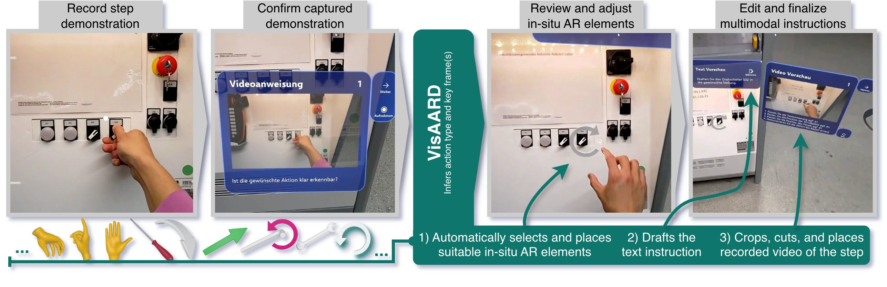

# VisAARD: Vision Language-supported Authoring of Augmented Reality via Demonstrations

**VisAARD** is an open-source, human-in-the-loop authoring tool designed to simplify the creation of AR procedural instructions. By combining egocentric video capture, hand-tracking, and Vision-Language Model (VLM) capabilities, it transforms physical demonstrations into digital, AR-based guidance consisting of textual, video, and 3D instrucional elements. VisAARD is published as part of the paper "Comparing AI-Assisted Authoring by Demonstration to Manual
Authoring of Augmented Reality Maintenance Instructions". This repository contains the technical prototype. For background information and details regarding the conducted user study involving this prototype, refer to the actual publication ([Knoben et al., 2026 (doi pending)](https://doi.org/10.XXXX/XXXXXX)).



## 🛠 System Architecture & Dependencies

VisAARD utilizes a split-system design.

### System Stack
| Component | Role | Technology |
| :--- | :--- | :--- |
| **HMD (Server)** | Front-end interface for capture and refinement | HoloLens 2, Unity 6 (6000.0.23f1), MRTK 3 |
| **PC (Cliet)** | Back-end for video processing and VLM queries | Python 3.11.8 |
| **VLM** | Action understanding and text generation | OpenAI GPT-5.2 |

### Communication Stack

The underlying communication between the HoloLens 2 and the PC is built upon three open-source projects:

-   **[hl2ss](https://github.com/jdibenes/hl2ss)**: Utilized for high-efficiency streaming of sensor data and egocentric video from the HoloLens 2.
    
-   **[NativeWebSocket (NWS)](https://github.com/endel/NativeWebSocket)**: A dedicated WebSocket channel on the HL2 server to support control messages and back-end requests initiated by the HMD.
    
-   **[python-websocket-server](https://github.com/Pithikos/python-websocket-server)**: WebSocket implementation on the pc client side to handle incoming requests by HL2

## 📂 Repository Structure

-   **`/hl2-unity`**: Contains the server-side Unity implementation for authoring on the HoloLens 2.
-   **`/pc-python`**: Contains the client-side Python application for streaming, analyzing and communicating with HL2.    


## 🏁 Installation Guide

### 1. Python Back-end (PC Client)

1.  Launch the client app via visard_client.py (main entry point)

2.  On missing package error, install missing libraries in active environment

3.  Specify ws_host and ws_port to listen for incoming connection requests

### 2. Unity Front-end (HoloLens 2 Server)

1.  Configure the Unity project so that the **[MRTK3](https://github.com/MixedRealityToolkit/MixedRealityToolkit-Unity/blob/main/README.md)**, **[NativeWebSocket](https://github.com/endel/NativeWebSocket/blob/master/README.md)** library, and **[hl2ss unity plugin](https://github.com/jdibenes/hl2ss/blob/main/README.md)** are correctly installed.
2.  Make sure to enable relevant capabilities under "Project Settings" - "Player" - "Publishing Settings" - "Capabilities"  (InternetClient, InternetClientServer, PrivateNetworkClientServer, VideosLibrary, WebCam, Microphone, SpatialPerception) and set "Supported Device Families" to "Holographic".

3.  Build and deploy the solution to your HoloLens 2 (ARM64,WindowsSDK 10.0.22621.0,Master)

4.  Connect to the ip address displstrong textayed by the client. Text input is only enabled via bluetooth keyboard. Make sure to enable camera access in app settings.


## 📝 Citation

If you use this work or the VisAARD tool in your research, please cite our paper:

```
@inproceedings{knoben_comparing_2026,
	title = {Comparing {AI}-{Assisted} {Authoring} by {Demonstration} to {Manual} {Authoring} of {Augmented} {Reality} {Maintenance} {Instructions}},
	booktitle = {accepted},
	publisher = {ACM},
	author = {Knoben, Valentin and Blattgerste, Jonas and Hein, Björn and Wurll, Christian},
	year = {2026},
}
```
