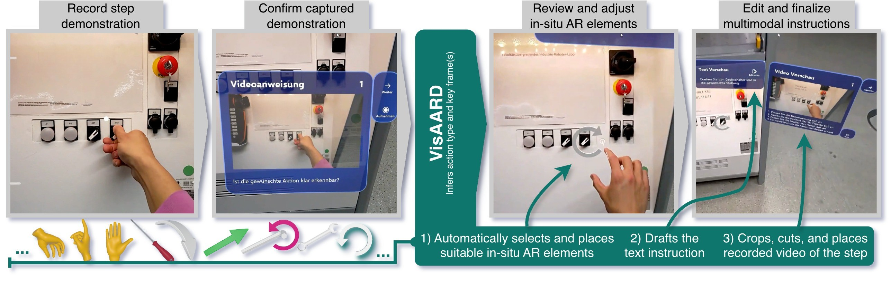

# VisAARD: Vision Language-supported Authoring of Augmented Reality via Demonstrations

**VisAARD** is an open-source, human-in-the-loop authoring tool designed to simplify the creation of AR procedural instructions. By combining egocentric video capture, hand-tracking, and Vision-Language Model (VLM) capabilities, it transforms physical demonstrations into digital, AR-based guidance consisting of textual, video, and 3D instrucional elements. VisAARD is published as part of the paper "Comparing AI-Assisted Authoring by Demonstration to Manual Authoring of Augmented Reality Maintenance Instructions". This repository contains the technical prototype. For background information and details regarding the conducted user study involving this prototype, refer to the actual publication ([Knoben et al., 2026](https://dl.acm.org/doi/10.1145/3820253.3820275)).



## 🛠 System Architecture & Dependencies

VisAARD utilizes a split-system design.

### System Stack
| Component | Role | Technology |
| :--- | :--- | :--- |
| **HMD (Server)** | Front-end interface for capture and refinement | HoloLens 2, Unity 6 (6000.0.23f1), MRTK 3 |
| **PC (Cliet)** | Back-end for video processing and VLM queries | Python 3.11.8 |
| **VLM** | Action understanding and text generation | OpenAI GPT-5.2 |

### Communication Stack

The underlying communication between the HoloLens 2 and the PC is built upon three open-source projects:

-   **[hl2ss](https://github.com/jdibenes/hl2ss)**: Utilized for high-efficiency streaming of sensor data and egocentric video from the HoloLens 2.
    
-   **[NativeWebSocket (NWS)](https://github.com/endel/NativeWebSocket)**: A dedicated WebSocket channel on the HL2 server to support control messages and back-end requests initiated by the HMD.
    
-   **[python-websocket-server](https://github.com/Pithikos/python-websocket-server)**: WebSocket implementation on the pc client side to handle incoming requests by HL2

## 📂 Repository Structure

-   **`/hl2-unity`**: Contains the server-side Unity implementation for authoring on the HoloLens 2.
-   **`/pc-python`**: Contains the client-side Python application for streaming, analyzing and communicating with HL2.    


## 🏁 Installation Guide

### 1. Python Back-end (PC Client)

1.  Launch the client app via visard_client.py (main entry point)

2.  On missing package error, install missing libraries in active environment

3.  Specify ws_host and ws_port to listen for incoming connection requests

### 2. Unity Front-end (HoloLens 2 Server)

1.  Configure the Unity project so that the **[MRTK3](https://github.com/MixedRealityToolkit/MixedRealityToolkit-Unity/blob/main/README.md)**, **[NativeWebSocket](https://github.com/endel/NativeWebSocket/blob/master/README.md)** library, and **[hl2ss unity plugin](https://github.com/jdibenes/hl2ss/blob/main/README.md)** are correctly installed.
2.  Make sure to enable relevant capabilities under "Project Settings" - "Player" - "Publishing Settings" - "Capabilities"  (InternetClient, InternetClientServer, PrivateNetworkClientServer, VideosLibrary, WebCam, Microphone, SpatialPerception) and set "Supported Device Families" to "Holographic".

3.  Build and deploy the solution to your HoloLens 2 (ARM64,WindowsSDK 10.0.22621.0,Master)

4.  Connect to the ip address displstrong textayed by the client. Text input is only enabled via bluetooth keyboard. Make sure to enable camera access in app settings.


## 📝 Citation

If you use this work or the VisAARD tool in your research, please cite our paper:

```
@inproceedings{Knoben2026Comparing,
author = {Knoben, Valentin Tang and Blattgerste, Jonas and Hein, Bj{\"o}rn and Wurll, Christian},
title = {Comparing AI-Assisted Authoring by Demonstration to Manual Authoring of Augmented Reality Maintenance Instructions},
year = {2026},
isbn = {9798400726118},
publisher = {Association for Computing Machinery},
address = {New York, NY, USA},
url = {https://doi.org/10.1145/3820253.3820275},
doi = {10.1145/3820253.3820275},
abstract = {Creating Augmented Reality (AR) instructions for industrial guidance remains labor-intensive, while fully automated solutions are often impractical. To bridge this gap, we present VisAARD, an open-source, human-in-the-loop authoring tool that combines vision-language models with authoring by demonstration. From stepwise expert demonstrations, VisAARD uses egocentric video and hand-tracking to generate textual descriptions and propose in-situ 3D guidance elements for later review and refinement. In a within-subject study (N=21), we compared VisAARD against an industry-standard manual authoring baseline similar to Microsoft Dynamics 365 Guides in a robotic-cell maintenance scenario. Compared to the baseline, VisAARD reduced mean authoring time from 36 to under 20 minutes, lowered perceived task load, achieved higher perceived usability, and was preferred by 20 out of 21 participants. Qualitative feedback further suggests that a hybrid workflow combining the efficiency of AI-assisted authoring with targeted manual refinement is perceived as a meaningful direction for AR authoring tools.},
booktitle = {Proceedings of Mensch Und Computer 2026},
pages = {396–409},
numpages = {14},
keywords = {Augmented Reality, Authoring Tools, Authoring by Demonstration, Vision-Language Models, Human-in-the-Loop AI, Industrial Guidance, Maintenance Instructions},
location = {Duisburg},
series = {MuC '26}
}
```
